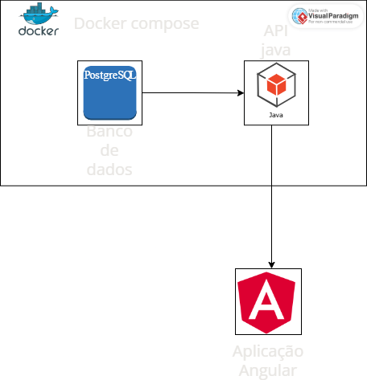

# SuperPoderes


---

## Requisitos

Para rodar localmente:

- **Git**
- **Docker** e **Docker Compose**
- Docker Engine + Compose v2 (recomendado)
  
---

## Como rodar localmente (Docker Compose)

### Clone o repositório:

```bash
git clone https://github.com/gaaaabz/SuperPoderes.git
cd SuperPoderes
```

### Subir os serviços
Importante!
se estiver usando windows é necessario estar com o docker desktop aberto

```bash
docker compose up -d
```

### Verificar status

```bash
docker compose ps
```

### Ver logs

```bash
docker compose logs -f
```

### Parar

```bash
docker compose down
```

### Rebuild (quando mudar Dockerfile/dependências)

```bash
docker compose up -d --build
```

---

## Logs e troubleshooting

### Porta já em uso
Se ao subir der erro de porta ocupada, verifique o que está usando:

```bash
lsof -i :<porta>
```

Ajuste a porta no `docker-compose.yml` (mapeamento `HOST:CONTAINER`) ou pare o processo que está ocupando.

### Resetar ambiente 
Se quiser “zerar”:

```bash
docker compose down -v
docker compose up -d --build
```

---

